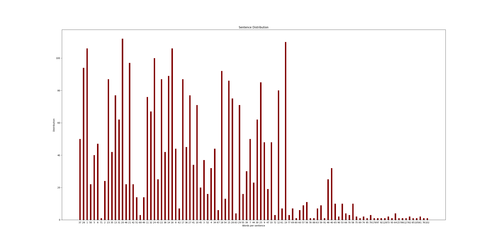

# text-analyzer-GCP

*This application takes a text url as input, computes sentence distribution and generates a graphical representation of number-of-words to occurance to be displayed in the UI. Below is an example of one such graph corresponding to the text at https://www.gutenberg.org/files/84/84-0.txt*

